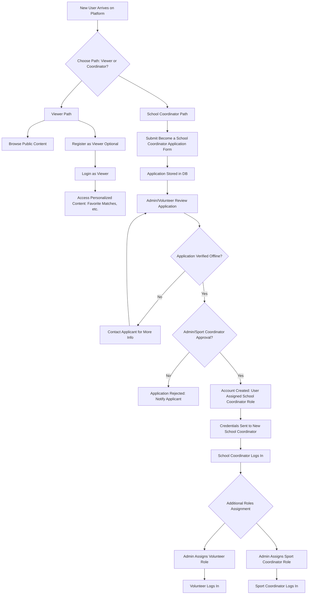
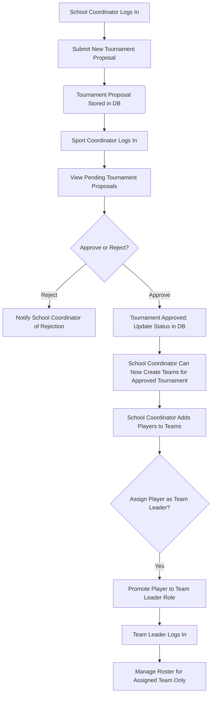

# **Software Requirements Specification (SRS)**

## **Uni Sports Council (USC) Digital Platform \- Version 1.0**

|  |  |
| :---- | :---- |
| **Document Version:** | 1.0 |
| **Status:** | Draft for Review |
| **Date:** | 28-09-2025 |
| **Prepared For:** | Uni Sports Council |
| **Prepared By:** | Rounik Mondal |

### **Table of Contents**

1. Introduction  
2. Overall Description  
3. System Features and Requirements  
4. External Interface Requirements  
5. Non-Functional Requirements  
6. V1.0 Strategic Exclusions (Roadmap for V2.0)  
7. Appendices

### **1\. Introduction**

#### **1.1 Purpose**

This document provides a detailed specification for the Uni Sports Council (USC) digital platform, Version 1.0. It outlines the scope, features, user roles, functional, and non-functional requirements of the system. This SRS will serve as the guiding document for the project's design, development, and quality assurance phases.

#### **1.2 Project Scope**

The project's goal is to develop a centralized, pro-grade digital platform to manage all USC sports activities. The platform will serve as a single source of truth for tournament fixtures, live scores, team and player statistics, registrations, and results. It is designed to be scalable, operated by non-technical administrators, and provide a seamless, mobile-first experience for all users.

#### **1.3 Intended Audience**

This document is intended for project stakeholders, including the client, project managers, UI/UX designers, software developers, and quality assurance teams.

#### **1.4 Definitions, Acronyms, and Abbreviations**

* **USC:** Uni Sports Council  
* **SRS:** Software Requirements Specification  
* **RBAC:** Role-Based Access Control  
* **KYC:** Know Your Customer  
* **UI:** User Interface  
* **API:** Application Programming Interface  
* **PWA:** Progressive Web App

### **2\. Overall Description**

#### **2.1 Product Perspective**

The USC Platform will be a new, standalone, web-based application built from the ground up. It will replace any existing manual or fragmented processes with a cohesive, secure, and efficient digital workflow.

#### **2.2 Product Features (High-Level)**

* **Advanced Role-Based Access Control:** A sophisticated system with distinct user roles, including dynamic, per-user permissions for Volunteers.  
* **Tournament & Team Management:** End-to-end workflow for proposing tournaments, getting approvals, creating teams, and managing player rosters.  
* **Player & KYC Management:** A centralized system for player profiles and verification.  
* **Live Score Management:** A console for authorized users to update match scores in near real-time.  
* **Payment Integration:** Secure collection of registration fees via Razorpay.  
* **Public Information Portal:** A responsive public-facing website for viewers to access match schedules, scores, and team information.

#### **2.3 User Classes and Characteristics**

| Role | Description |
| :---- | :---- |
| **Admin** | Super user with unrestricted access to all platform features. Manages users, can bypass workflows, and has ultimate control over all data, including Volunteer permissions. |
| **Sport Coordinator** | Gatekeeper for sporting events. Reviews and approves/rejects tournament proposals submitted by School Coordinators. |
| **School Coordinator** | School representative. Onboards their school, submits tournament proposals, creates teams, and assigns Team Leaders. |
| **Team Leader** | Delegated by a School Coordinator. Manages the player roster and basic logistics for their single, assigned team. |
| **Volunteer** | Operational support. Assists with tasks like KYC verification, team management, and score updates. Their specific abilities are dynamically configured by an Admin on a per-user basis. |
| **Player** | A registered participant. Responsible for completing their own KYC profile after being added to a team roster. |
| **Viewer** | Any public or registered user. Can browse public content, view live scores, and access personalized features like favoriting matches. |

#### **2.4 Operating Environment**

The platform will operate as a responsive web application, accessible through modern web browsers (Chrome, Firefox, Safari, Edge) on desktops, tablets, and mobile devices.

#### **2.5 Design and Implementation Constraints**

* **Technology Stack:** The application will be built using Next.js (React), with a PostgreSQL database managed via Prisma ORM, and Clerk for authentication.  
* **Responsive Design:** The UI must be fully responsive and provide a seamless experience across all screen sizes.  
* **V1.0 Design Strategy:** For an efficient V1.0 launch, certain complex features will be simplified. The primary simplification is a polling-based mechanism for live scoring to provide a near real-time experience.

### **3\. System Features and Requirements**

#### **3.1 User Authentication and Role Management**

* **3.1.1 Registration & Login:** Users can register as Viewers or apply for specialized roles. All authenticated users will log in via a secure process managed by Clerk, supporting email/password and OTP methods.  
* **3.1.2 Role-Based Access Control (RBAC):** The system will enforce strict permissions based on the user's assigned role, ensuring users can only access the features and data relevant to their function.  
* **3.1.3 Dynamic Volunteer Permissions:**  
  * **3.1.3.1 Admin Control Panel:** The Admin will have a dedicated interface to manage permissions for each user with the "Volunteer" role.  
  * **3.1.3.2 Granular Controls:** For each Volunteer, the Admin can enable or disable specific capabilities, such as 'Can Verify Player KYC', 'Can Edit Live Scores', 'Can Manage School Rosters', etc., via a checklist interface.  
  * **3.1.3.3 Secure Enforcement:** The system's backend will check for these specific permissions before allowing any action, ensuring granular control is enforced securely at the API level.

#### **3.2 School Coordinator Onboarding Module**

* **3.2.1 Application Process:** A dedicated "Become a School Coordinator" application form will be available on the platform.  
* **3.2.2 Approval Workflow:** Submissions will enter a review queue. Volunteers will perform manual off-platform verification, after which an Admin or Sport Coordinator can approve or reject the application within the system, triggering the creation of a School Coordinator account.

#### **3.3 Tournament and Team Management Module**

* **3.3.1 Tournament Proposal Workflow:** Logged-in School Coordinators can submit proposals for new tournaments. These proposals are reviewed and approved/rejected by a Sport Coordinator.  
* **3.3.2 Team & Roster Management:** Upon tournament approval, the School Coordinator can create teams and manage player rosters for that specific event.  
* **3.3.3 Team Leader Delegation:** The School Coordinator can promote a player from their roster to the "Team Leader" role, granting them permission to manage that specific team's roster.

#### **3.4 Player Management and KYC Module**

* **3.4.1 Player Profiles:** Each player will have a unique profile.  
* **3.4.2 KYC Workflow:** Players are responsible for logging in and submitting their KYC details. This submission enters a queue for a Volunteer to review and approve. A player's KYC status must be "Approved" to be fully eligible.

#### **3.5 Match Management and Scoring Module**

* **3.5.1 Live Scoring Console:** An authorized user (e.g., Volunteer) will access a secure console to update scores and key events for an ongoing match.  
* **3.5.2 Near Real-Time Updates:** The public-facing match pages will employ a polling mechanism, automatically refreshing every 30-60 seconds to fetch the latest score data, providing a "live-ish" experience.  
* **3.5.3 Results Finalization:** The scorer will finalize the match results, which will then be permanently recorded and used to update standings and leaderboards.

#### **3.6 Payment Processing Module**

* **3.6.1 Razorpay Integration:** The platform will be integrated with Razorpay to handle payments for tournament registrations.  
* **3.6.2 Automated Status Updates:** Upon successful payment, a webhook from Razorpay will automatically update the team's registration status to "Paid" in the database.

### **4\. External Interface Requirements**

#### **4.1 User Interfaces**

The UI will be clean, modern, and highly intuitive. It will be fully responsive, ensuring usability and readability on all device types. Key interfaces include the public portal, admin dashboards, scoring console, and user profile pages.

#### **4.2 Software Interfaces**

* **Clerk:** For user authentication, session management, and role definition.  
* **Razorpay:** For processing all financial transactions.  
* **ImageKit:** For optimized storage, transformation, and delivery of all media assets (e.g., KYC documents, team logos).

### **5\. Non-Functional Requirements**

#### **5.1 Performance**

* Server response time for critical API calls should be under 500ms.  
* The live score polling interval will be set to a default of 45 seconds, configurable by an Admin.

#### **5.2 Security**

* All data transmission will be encrypted using HTTPS.  
* RBAC will be strictly enforced at the API level to prevent unauthorized data access.  
* Sensitive data (e.g., passwords, KYC details) will be securely handled and stored.

#### **5.3 Scalability**

The architecture will be designed to handle a growing number of users, teams, and concurrent tournaments without degradation in performance.

#### **5.4 Usability and Accessibility**

The platform will adhere to modern usability principles and aim for WCAG 2.1 AA compliance to ensure it is accessible to users with disabilities.

### **6\. V1.0 Strategic Exclusions (Roadmap for V2.0)**

To ensure a focused and timely delivery of the core platform, the following complex features will be excluded from the initial V1.0 release and are planned for future development cycles:

* **Advanced Automations:** Features such as automated email/SMS reminders for matches, nightly leaderboard calculations, and other background jobs are deferred.  
* **Progressive Web App (PWA):** Offline capabilities, particularly for the scoring console, are planned for a future release.  
* **Automated Certificate Generation:** The system for automatically creating and distributing participation/winner certificates is slated for V2.0.

### **7\. Appendices**

#### **Appendix A: Technology Stack Summary**

| Component | Technology | Rationale |
| :---- | :---- | :---- |
| **Framework** | Next.js (React) | Modern, performant full-stack framework for frontend and backend. |
| **Database** | PostgreSQL | Robust, reliable, and scalable open-source relational database. |
| **ORM** | Prisma | Modern, type-safe database toolkit for simplified data access. |
| **Authentication** | Clerk | Provides a secure, feature-rich, and fast-to-implement auth solution. |
| **Styling** | Tailwind CSS | Utility-first CSS framework for rapid and consistent UI development. |
| **Media** | ImageKit | Cost-effective and powerful solution for media management and optimization. |
| **Deployment** | Vercel | Seamless, high-performance hosting optimized for Next.js applications. |
